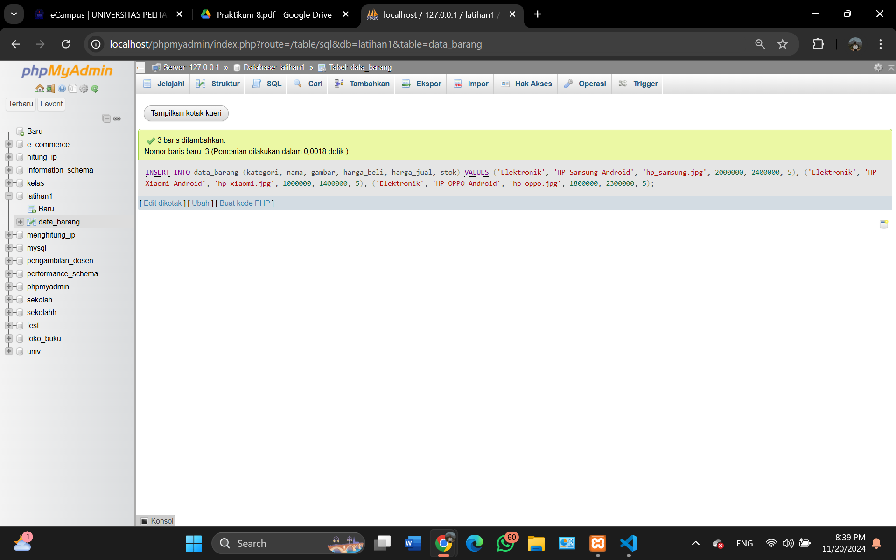

# Tugas Praktikum Pemrograman Web

#### Menjalankan Web Server

# 

#### 1. Membuat Database: Studi Kasus Data Barang, Membuat Database, Membuat Tabel

# 

#### 2. Menambahkan Data

# 

#### 3. Membuat Program CRUD, Buat folder lab8_php_database pada root directory web server

# 

#### 4. Membuat file koneksi database

# 

#### 5. Membuat file index untuk menampilkan data (Read), Buat file baru dengan nama index.php

# 

#### 6. Menambah Data (Create), Buat file baru dengan nama tambah.php
Menambahkan Data HP IPHONE

  

 Hasil
#  

#### 7. Mengubah Data (Update), Buat file baru dengan nama ubah.php
Merubah atau mengedit data Harga Pada HP SAMSUNG
 

Hasil
# 

#### 8. Menghapus Data (Delete), Buat file baru dengan nama hapus.php
Menghapus Data HP OPPO 

 

Hasil
# 
